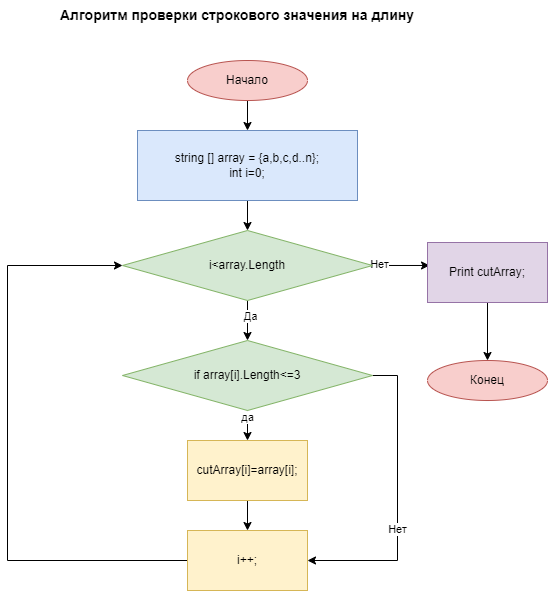

# **Контрольная работа №1.**

## Этапы выполенния работы:

1. Создать репозиторий на GitHub
2. Нарисовать блок-схему алгоритма (можно обойтись блок-схемой основной содержательной части, если вы выделяете её в отдельный метод)
3. Снабдить репозиторий оформленным текстовым описанием решения (файл README.md)
4. Написать программу, решающую поставленную задачу
5. Использовать контроль версий в работе над этим небольшим проектом (не должно быть так, что всё залито одним коммитом, как минимум этапы 2, 3, и 4 должны быть расположены в разных коммитах)

## Условия задачи:
>Написать программу, которая из имеющегося массива строк формирует новый массив из строк, длина которых меньше, либо равна 3 символам. Первоначальный массив можно ввести с клавиатуры, либо задать на старте выполнения алгоритма. При решении не рекомендуется пользоваться коллекциями, лучше обойтись исключительно массивами.

## Алгоритм решения задачи

## Описание алгоритма:

1. Сначала вводим строковый одномерный массив, в котором через запятую перечислены элементы массива. Поскольку это строковое значение в массиве могут содержаться различные элементы:   
    * Целые числа;
    * Дробные числа;
    * Отрицательные числа;
    * Символы;
    * Набор различных симоволов;
    * Слова
    * Предложения
    * и т.д.
2. Затем нам нужно запустить цикл (можно использовать цикл "for", который пройдет по каждому элементу массива)
3. Внутри цикла нужно запустить проверку
    * Если длина элемента *не превышает* 3-х символов, значит мы его переносим в новый массив.
    * Если длина элемента более 3-х символов, то мы его пропускаем.
4. Цикл завершается, когда пройдены все элементы. После этого мы выводим новый строковый массив на экран.

В своем коде я ипользовала метод, который решает пункты 2, 3, 4. Реализацию этого метода можно посмотреть в файле 

